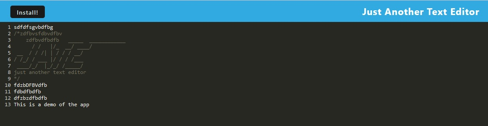

# pwa-text-editing-application

## Description

The motivation behind this project was to practice and clarify concepts and understanding related to the use of PWAs to create a functional application that is installable using the technology. It was difficult and I don't understand all of what the code does to the level I would like to, but I believe it does what is required. I will continue to revisit this to improve it, but for the moment I have to leave it as I have no further time or energy to understand or refine it. 

## Table of Contents

- [Description](#description)
- [Usage](#usage)
- [Deployment](#deployment)
- [Credits](#credits)
- [License](#license)

## Installation

Use npm install prior to use.
It should run via the npm run start:dev command. 

## Usage

Use npm run start and access the local host. Or deploy to Heroku.
It is a text editor that you can install in some browsers like Chrome.

## Deployment

What it looks like.

Deployment on Heroku [Here](https://limitless-peak-94119.herokuapp.com/)

## Creditsgit 

This project makes use of code from the bootcamp activities - although modified for this purpose.

The idea for the email validation came from here: https://stackoverflow.com/questions/18022365/mongoose-validate-email-syntax.

It also makes use of nodeJS, MongoDB, Mongoose, ExpressJs, DayJS and others.

The rest is my own work.

Credit also to my teachers, as without them this would not have been possible.

## License

Licensed under the MIT license.
